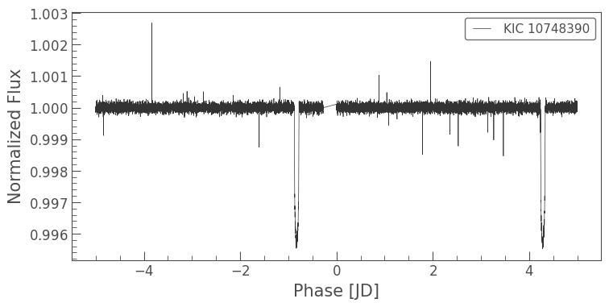

# Exoplanet Detection from Kepler Light Curves

**Field:** Computational Astrophysics

**Tools:** Python, Google Colab, Lightkurve, NumPy, Matplotlib, SciPy

## Overview

This is an independent computational astrophysics project using photometric observations from the NASA Kepler mission.

The project explores how computational methods can be used to analyze stellar light curves and identify periodic signals associated with exoplanet transits.

## Objective

The objective was to investigate whether a periodic transit signal could be identified from astronomical time-series data using Python.

## Data

The project analyzes Kepler observations of HAT-P-11.

## Method

The analysis involved:

1. Retrieving Kepler light-curve data using Lightkurve.
2. Examining and visualizing the observed photometry.
3. Cleaning and flattening the light curve.
4. Applying a Box Least Squares (BLS) periodogram to search for periodic transit signals.
5. Identifying the strongest candidate period.
6. Phase-folding the light curve using the detected period.
7. Visualizing the resulting signal.

## Results

The analysis identified a strong periodic signal in the selected search range and produced a corresponding phase-folded light curve.

### Key Outputs

The notebook contains visualizations of:

- The original Kepler light curve
- The processed/flattened light curve
- The BLS periodogram
- The phase-folded light curve

## What I Learned

This project gave me practical experience with:

- Real astronomical data
- Kepler photometry
- Astronomical time-series analysis
- Light-curve preprocessing
- Period-search methods
- Scientific visualization
- Python-based astrophysical analysis

More importantly, the project helped me understand how programming and computational methods can be used to investigate physical phenomena using real observational data.

## Connection to My Academic Interests

This project strengthened my interest in computational astrophysics and in combining physical understanding with computational methods and data analysis.

## Limitations

This project represents an introductory computational analysis rather than a validated exoplanet-discovery pipeline.

A more advanced investigation could include analysis of multiple observing sectors or targets, statistical validation of candidate signals, and comparison with established exoplanet catalogs.

## Notebook

The complete Python implementation is available in the accompanying Jupyter notebook.

**Google Colab:** To be added.

